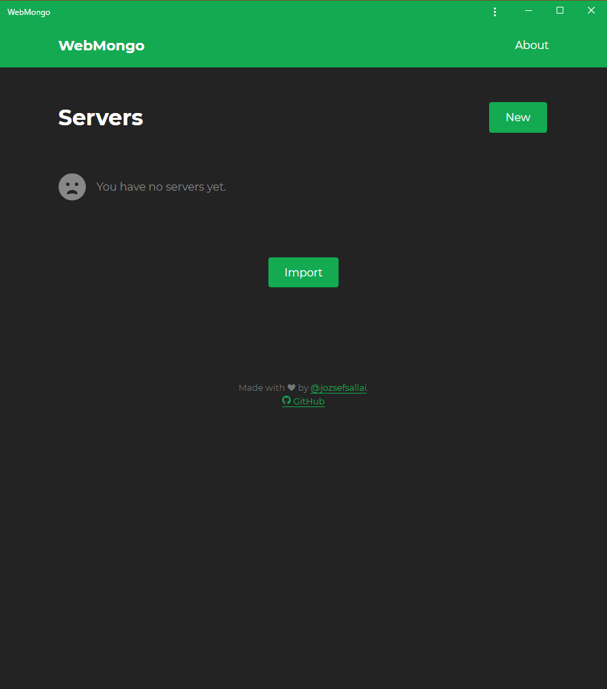

# WebMongo Documentation

**This documentation site is currently a work in progress.**

Welcome to the official documentation of [WebMongo][webmongo] - your new
favorite web UI for MongoDB. Using WebMongo you can view and manage an infinite
number of MongoDB web servers from any device, without risking the security of
your server connection strings.

## How It Works

**WebMongo** approaches storing the list of your servers in a different way.
Instead of storing your data on a centralized remote server, it stores your
server list in your browser's `localStorage`. This means that there is no way
someone can ever access your details unless they have direct physical access to
your device. Even so, you can always **lock your session** with a passphrase,
making it even more secure.

Since data is not stored on a remote server, you have to do the syncing
manually. Luckily, WebMongo was designed with easy syncing in mind. You can
export a passphrase-protected, encrypted file containing all of your connection
strings and import it on a different device.

You can read more about WebMongo, the motivation behind the project, and the way
it functions in [this article on dev.to][devto].

## First Steps

You can use **WebMongo** in two different ways, the only difference is how you
start. You can either:

- use the **[official production app][webmongo]**, or
- deploy your own instance.

Regardless of your choice, you will be met with the following screen:

From here, you can proceed to [add a server](./adding-servers.md).

[webmongo]: https://webmongo.now.sh "Open WebMongo"
[devto]: https://dev.to/jozsefsallai/managing-mongodb-servers-from-the-browser-using-webmongo-55jf "Managing MongoDB Servers From The Browser Using WebMongo"
