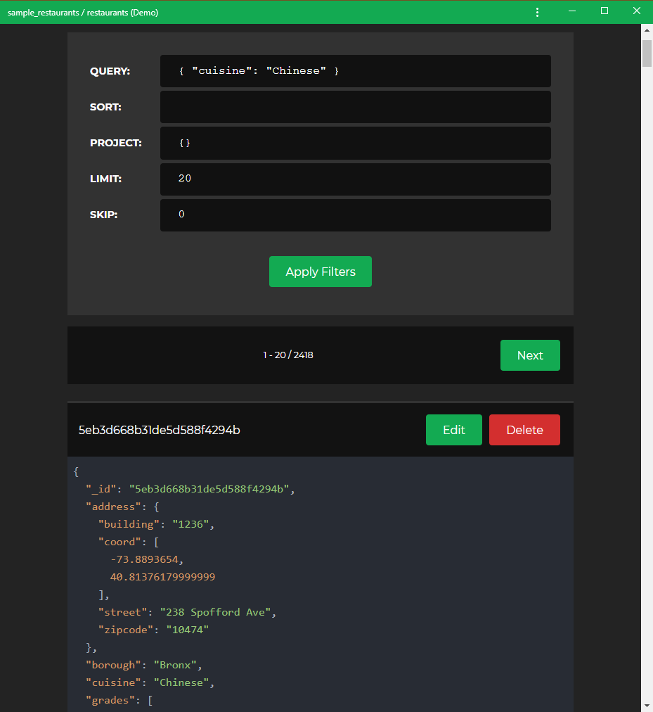

# Applying Filters

In **WebMongo**, you can apply any filtering conditions that you can use in
other MongoDB clients. In the example above, we query every document where the
value of the `cuisine` field is equal to `Chinese`.
