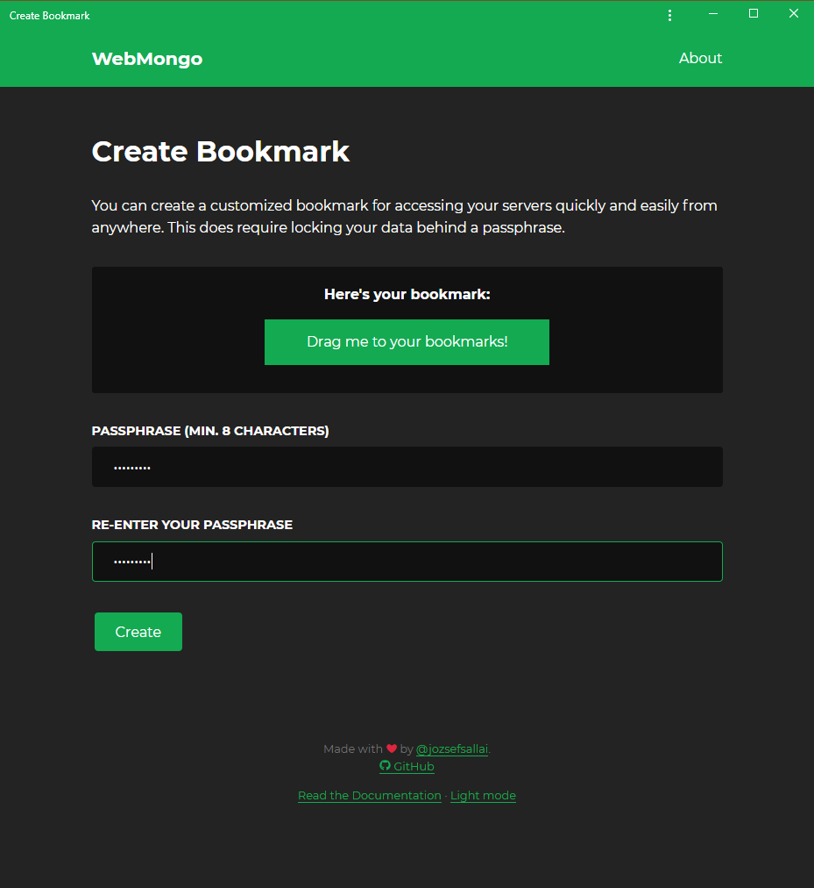

# Customized Bookmarks

For easier syncronization, you can create customized bookmarks that contain your
entire server list in an encrypted format. You can access the page using the
"**[Create a customized bookmark][create-bookmark-link]**" link on the home
page.

Once you provide a password, you'll be able to drag the generated button to your
browser's bookmarks bar. The link will lead to `webmongo.now.sh/b/`, accompanied
with a hash that contains your encrypted data.

[create-bookmark-link]: https://webmongo.now.sh/b/create
