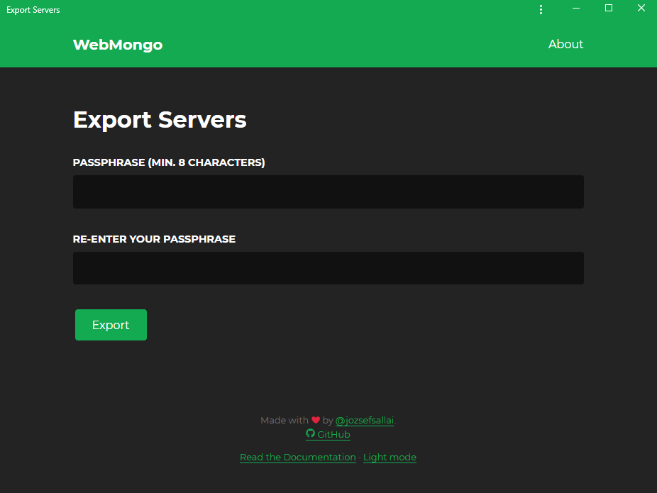
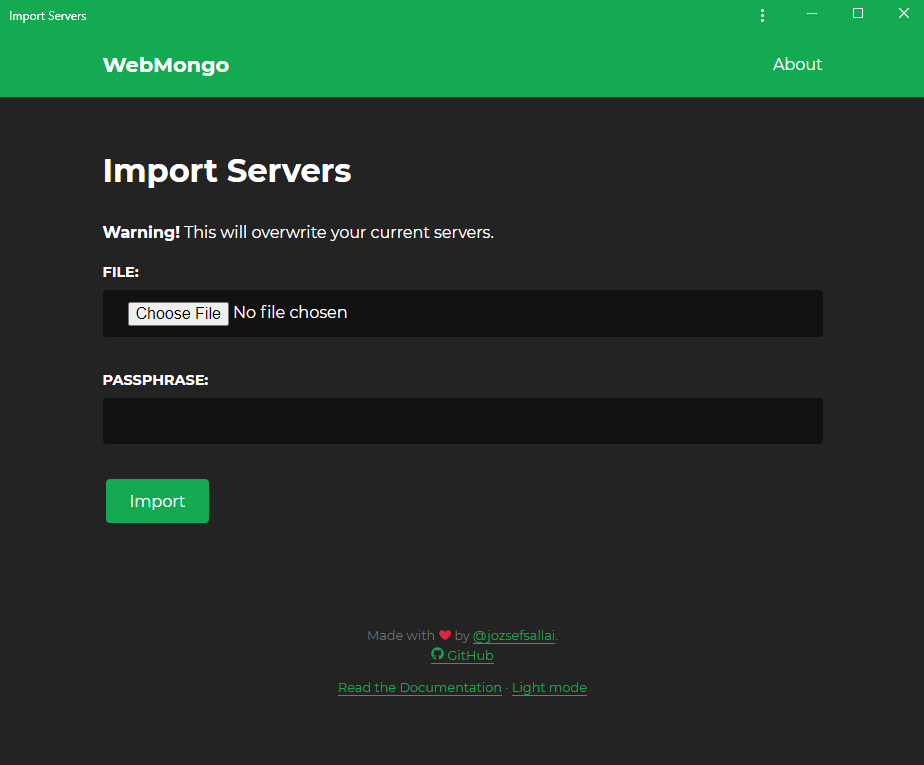

# Export/Import Server List

## Exporting

You can use the **[Export][export-page]** page to create an encrypted export
file that contains your current server list. The page will ask you for a
password to use for encrypting the data.

The password must be at least **8 characters** long. Saving also happens on the
client side, so the file will be generated by your browser, not the server.

## Importing

Likewise, you can use the **[Import][import-page]** page to upload a previously
exported file. Just select the file, enter the password that was used to encrypt
it, and you'll see the server list contained in the file instantly. Please note
that this will replace your current server list.

::: tip
Please, keep your export files in a safe place. While they are encrypted,
they're not impossible to crack. An attacker could use a brute-force attack to
guess the password, and depending on the strength of your password, they might
succeed.
:::

[export-page]: https://webmongo.now.sh/export
[import-page]: https://webmongo.now.sh/import
