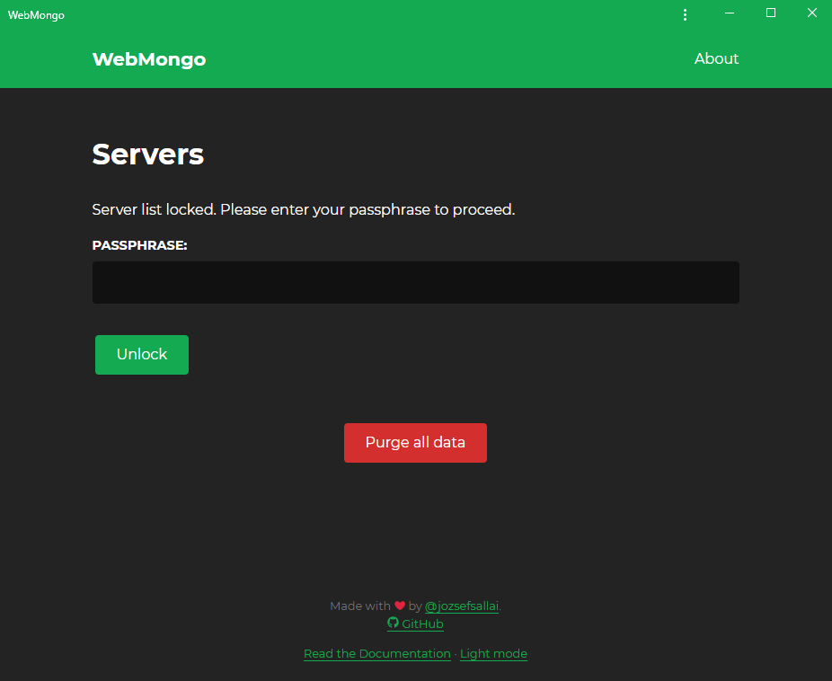

# Locking Your Session

On **WebMongo**, you can password-protect your current session. This means that your data will still be saved in your browser, but it will be encrypted the same way exporting works.

This feature is especially useful if other people can also access the device that you're using (for example, a school computer), but it's recommended to lock your session every now and then anyway. This way there will be no trouble, even if someone steals your device or you lose it.

Once you've locked your session, this is what the home page will look like:

As you can see, we only have two options: we can either unlock the list of servers using our password or we can purge all data.
