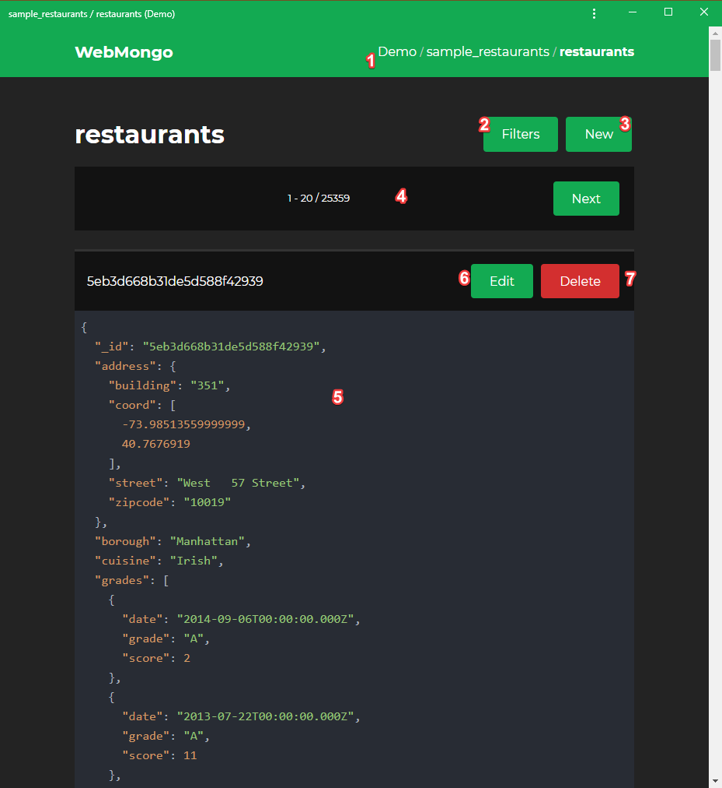

# Managing Documents

Once you select a collection, there are several things that you can do:

1. You can use the breadcrumbs to quickly go back to the database or the server.
2. You can specify the documents you can see using filters. You can set up various conditions, sorting options, projections, and you can specify how many documents should be displayed and how many should be skipped.
3. Using the **New** button you can create a new document in JSON format. While editing, a syntax highlighter and a smart editor will provide a more comfortable editing experience.
4. You can use the paginators to move forward and backward in the list of documents.
5. There's a block for each document. Each of these blocks has a header which contains the ID of the document. Under these headers, you'll see the document itself in JSON format with syntax highlighting.
6. You can use the **Edit** button from the header of each document to quickly change the data. It uses the same editor as the one mentioned in the 3rd point.
7. You can delete a document using the **Delete** button. WebMongo will ask for confirmation before you can perform the deletion.
