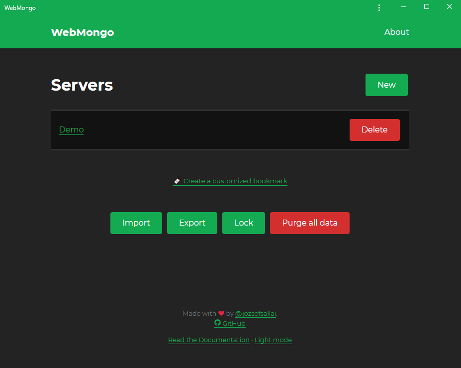
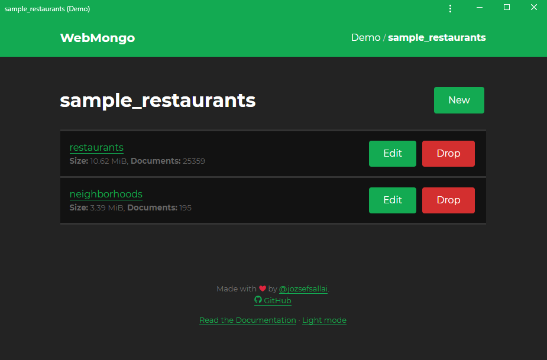

# Managing Servers and Databases

## Managing Servers

Now that you've added a server to **WebMongo**, it will appear in the home page
of the app. If you click on the name of the server, it will open the list of
databases that are available on it. The **Delete** button on the right side of
each server will delete it from WebMongo's memory.

You may notice that there are more options at the bottom of the page now than
when you didn't have any server. Now you can do the following things:

- **Import**: import a list of MongoDB servers from an encrypted and
password-protected file (this will overwrite your current list).
- **Export**: export the current list of servers.
- **Lock**: lock your current session using a password.
- **Purge all data**: delete the current server list.
- **Create a customized bookmark**: you can turn the current server list into an
encrypted bookmark link.

## Managing Databases and Collections

Once you've selected a database, you'll see the collections that exist in the
database:

Just like in the case of databases, you'll be able to see the name of the
collection and its size in human-readable format, but you'll also see the number
of documents that exist in the collection. You can use the **Edit** button to
change the name of the collection and you can also completely remove the
collection and all its data using the **Drop** button. Since this is a very
destructive feature, it will prompt you twice for confirmation.
